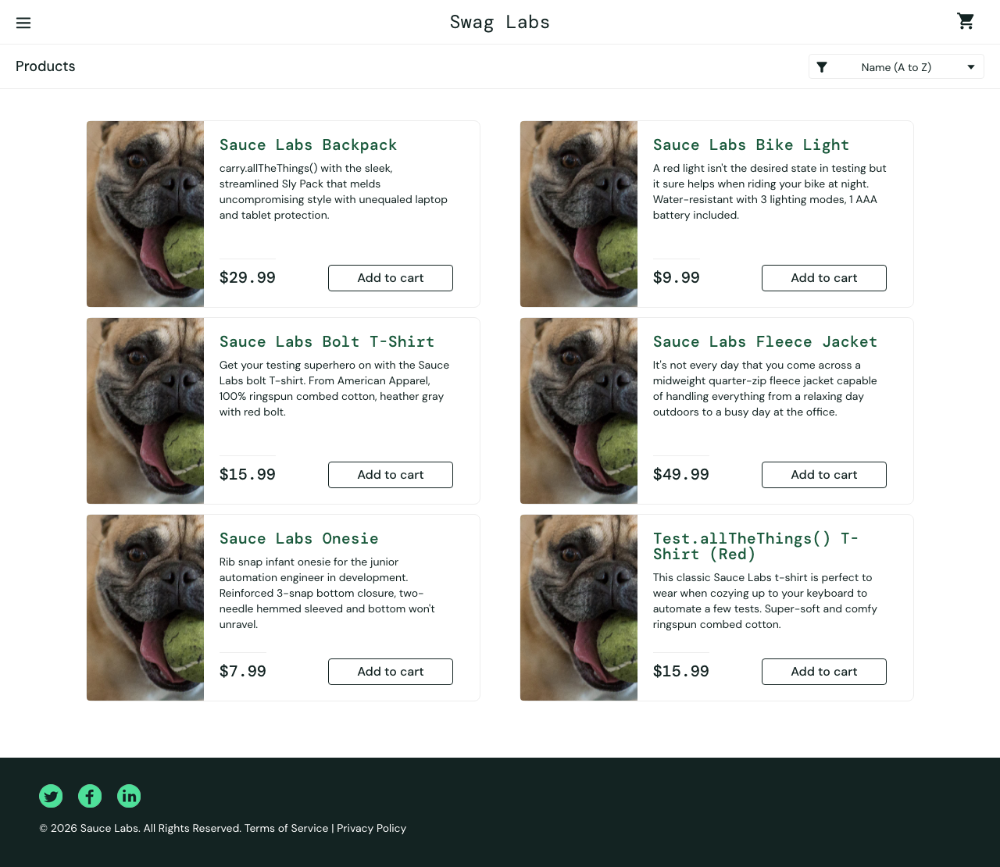
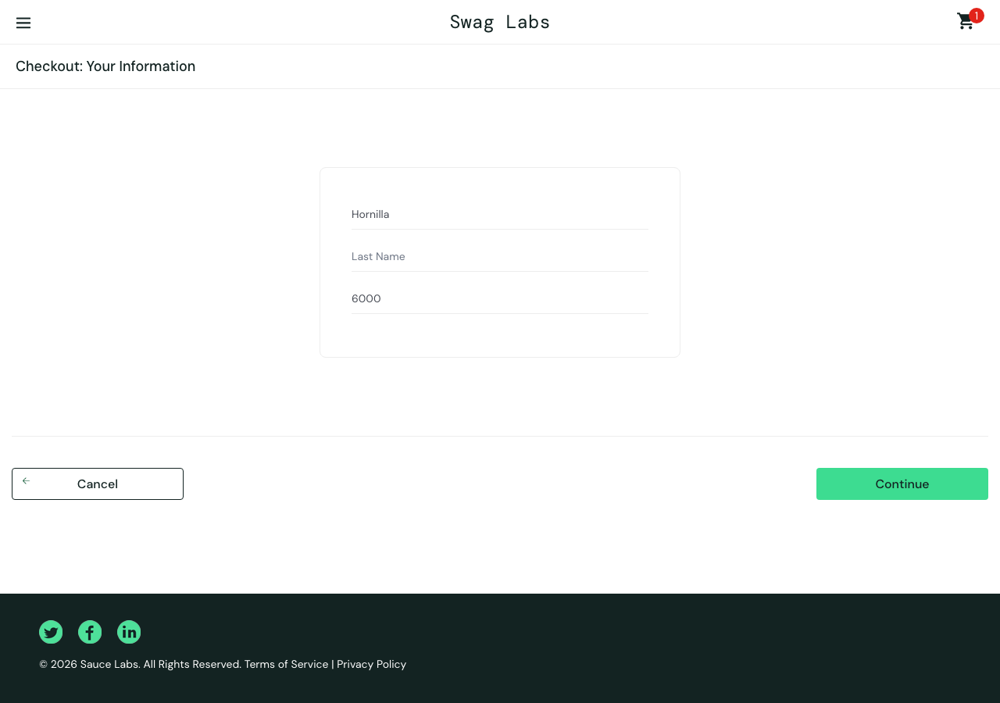

# Defect Report — saucedemo.com

**Reported by:** Jowelyn Hornilla
**Date:** 23 July 2026
**Build under test:** https://www.saucedemo.com (production demo)
**Environment:** Chromium 141 / macOS 15.5 — also reproduced on Firefox, WebKit, iPad, Pixel 5 and iPhone 13
**Automation:** `tests/known-defects.spec.ts`

---

## Summary

Six defects were found on the `problem_user` account. Three are **Critical**: they block the
core purchase journey outright — a customer using this account cannot remove an item from
their cart, cannot add three of the six products, and can never complete checkout.

All six were verified against a control account (`standard_user`) on the same build. Every
check passes there, so these are account-state defects rather than broken tests or an
environment problem.

| ID | Title | Severity | Blocks purchase |
| --- | --- | --- | --- |
| [BUG-001](#bug-001) | All six products render the same image | Medium | No |
| [BUG-002](#bug-002) | Add to cart is dead on three products | **Critical** | Yes |
| [BUG-003](#bug-003) | Items cannot be removed from the cart | **Critical** | Yes |
| [BUG-004](#bug-004) | Sort dropdown rejects any new selection | High | No |
| [BUG-005](#bug-005) | Last Name field writes into First Name | **Critical** | Yes |
| [BUG-006](#bug-006) | Cart badge over-counts after a dead Remove | Medium | No |

**Reproduction rate:** 6/6 — every defect reproduced on every attempt, on every browser and
viewport tested.

---

## How to reproduce all of these

```bash
npx playwright test tests/known-defects.spec.ts
```

Each defect is covered by a test that asserts the **correct** behaviour and is marked
`test.fail()`. The suite therefore reports green while these bugs exist. The moment a fix
lands, Playwright reports the test as an unexpected pass, which is the signal to delete the
annotation and let it guard the fix as a normal regression test.

---

<a name="bug-001"></a>
## BUG-001 — All six products render the same image

**Severity:** Medium  **Priority:** Medium  **Area:** Inventory / Products page

Every product on the inventory page shows an identical photograph (a dog with a tennis
ball) instead of its own product image. Product names, descriptions and prices are correct.

**Steps to reproduce**
1. Log in as `problem_user` / `secret_sauce`
2. Observe the six product cards on the Products page

**Expected:** each product displays its own distinct image.
**Actual:** all six `` elements resolve to the same `src`.

**Evidence**

`6 products, 1 unique image src`



**Impact:** customers cannot visually distinguish products, which on a real store would
directly depress conversion and drive returns from mis-ordered items.

---

<a name="bug-002"></a>
## BUG-002 — Add to cart is dead on three products

**Severity:** Critical  **Priority:** High  **Area:** Inventory / Cart

The **Add to cart** button does nothing for three of the six products. The button label
never changes to *Remove*, no badge appears, and the product is not added.

**Affected products**
- Sauce Labs Bolt T-Shirt
- Sauce Labs Fleece Jacket
- Test.allTheThings() T-Shirt (Red)

Working: Backpack, Bike Light, Onesie.

**Steps to reproduce**
1. Log in as `problem_user`
2. Click **Add to cart** on *Sauce Labs Bolt T-Shirt*

**Expected:** button changes to *Remove* and the cart badge increments.
**Actual:** button stays *Add to cart*; nothing is added.

**Impact:** 50% of the catalogue cannot be purchased at all. Direct, unrecoverable revenue
loss on those lines.

---

<a name="bug-003"></a>
## BUG-003 — Items cannot be removed from the cart

**Severity:** Critical  **Priority:** High  **Area:** Cart

For the three products that *can* be added, the **Remove** button does nothing. Once an
item is in the cart it cannot be taken out from the products page.

**Affected products**
- Sauce Labs Backpack
- Sauce Labs Bike Light
- Sauce Labs Onesie

**Steps to reproduce**
1. Log in as `problem_user`
2. Click **Add to cart** on *Sauce Labs Backpack* — badge shows `1`
3. Click **Remove**

**Expected:** the item is removed and the badge returns to empty.
**Actual:** the button stays on *Remove* and the badge stays at `1`.

**Impact:** a customer cannot correct a mistake. Combined with BUG-002 the cart becomes a
one-way door, which is a common cause of abandoned checkouts.

---

<a name="bug-004"></a>
## BUG-004 — Sort dropdown rejects any new selection

**Severity:** High  **Priority:** Medium  **Area:** Inventory / Sorting

Choosing any option in the sort dropdown has no effect. This is not merely a failure to
re-order the grid — the `<select>` element itself refuses the change and reverts to
`Name (A to Z)`.

**Steps to reproduce**
1. Log in as `problem_user`
2. Select **Name (Z to A)** from the sort dropdown

**Expected:** dropdown value becomes `za` and the grid reverses.
**Actual:** dropdown value stays `az`; grid order is unchanged.

**Evidence — measured control comparison**

```
problem_user  | dropdown "az" -> "az" | first item "Sauce Labs Backpack" -> "Sauce Labs Backpack"
standard_user | dropdown "az" -> "za" | first item "Sauce Labs Backpack" -> "Test.allTheThings() T-Shirt (Red)"
```

Full-page screenshots taken immediately before and immediately after the sort are
**byte-identical** (MD5 `efda81862c848ab19bc92366f8a3e089`), confirming nothing on the page
changed at all.


**Impact:** on a catalogue larger than six items, losing sort makes the store impractical to
browse.

---

<a name="bug-005"></a>
## BUG-005 — Last Name field writes into First Name

**Severity:** Critical  **Priority:** High  **Area:** Checkout — Your Information

The Last Name input is bound to the First Name field's state. Typing a last name
**overwrites the first name**, and Last Name itself stays permanently empty. Because Last
Name is a required field, checkout can never be completed.

**Steps to reproduce**
1. Log in as `problem_user`, add *Sauce Labs Backpack*, open the cart, click **Checkout**
2. Type `Jowelyn` into **First Name**
3. Type `Hornilla` into **Last Name**

**Expected:** First Name = `Jowelyn`, Last Name = `Hornilla`.
**Actual:** First Name = `Hornilla`, Last Name = empty.

**Evidence — measured control comparison**

```
problem_user  | typed "AAAA" into First -> first="AAAA" last=""
problem_user  | typed "BBBB" into Last  -> first="BBBB" last=""     <-- First Name overwritten
standard_user | typed "AAAA" into First -> first="AAAA" last=""
standard_user | typed "BBBB" into Last  -> first="AAAA" last="BBBB" <-- correct
```



In the screenshot the first field contains `Hornilla` and the Last Name field still shows
its placeholder.

**Impact:** the highest-severity defect found. No order can be placed on this account —
100% checkout failure. The silent overwrite is especially damaging because a customer
filling the form quickly may not notice their first name was replaced.

**Suggested root cause:** the Last Name input's change handler is almost certainly writing
to the `firstName` piece of state — a copy-paste error in the form component.

---

<a name="bug-006"></a>
## BUG-006 — Cart badge over-counts after a dead Remove

**Severity:** Medium  **Priority:** Low  **Area:** Cart badge

A knock-on effect of BUG-003. Because Remove silently fails, the badge keeps counting items
the customer believes they have removed, so the header count no longer reflects the
customer's intent.

**Steps to reproduce**
1. Log in as `problem_user`
2. Add *Backpack*, *Bike Light* and *Onesie* — badge shows `3`
3. Click **Remove** on each

**Expected:** badge decrements to `0` and disappears.
**Actual:** badge stays at `3`.

**Impact:** low on its own; listed separately because it is user-visible and would be worth
a regression test even after BUG-003 is fixed.

---

## Notes on test validity

Every defect above was checked against `standard_user` on the same build in the same run.
All checks pass there. That control is itself automated — see the *Control — standard_user
is unaffected* test — so if a future change breaks the control, the suite reports it rather
than quietly producing false bug reports.

## Recommended fix order

1. **BUG-005** — blocks 100% of orders
2. **BUG-002** — blocks 50% of the catalogue
3. **BUG-003** — traps items in the cart
4. **BUG-004** — browsing usability
5. **BUG-001** — product presentation
6. **BUG-006** — resolves with BUG-003; keep the regression test
